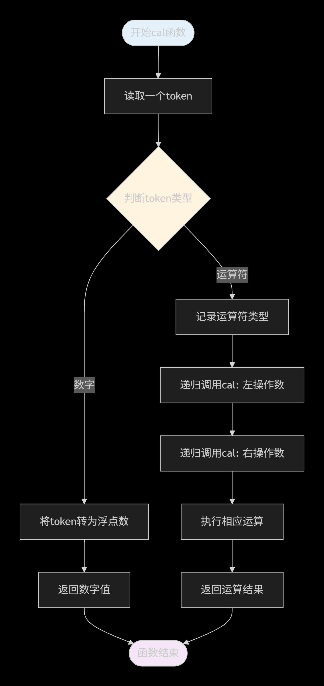

---
tags:
  - 递归
  - 表达式
---
[[递归介绍和master公式]]
概念：波兰表达式，也叫前缀表达式，我们目前使用的大部分都是 中缀表达式，所以前缀表达式，顾名思义，就是把所有运算符放到 操作数的前面， 如： + 3 5（3 + 5）、 * + 2 5 6（（2 + 5）* 6）

前缀表达式会计算他后面的两个操作数，用到代码实现时可以考虑使用 递归的方法

## 简单理解原理
	思路是，在遇到运算符时，调用递归函数，碰到数字，进行计算

## 流程图

## 实现思路
	输入一个字符串，判断每一位，如果是运算符，就保留当前层运算符，用变量a接受左操作数，调用递归，左值算出来后，再算右值，最后用当前层运算符计算，将得到的值传递给上层；如果为数组，判断位数，得到数值；

## 简单的实现

	这个只针对单个位数的情况

## 个人的复杂实现但功能比上面的更强大

## 窃窃私语
	虽然不确定你以后会不会看这些，但如果有一天真的需要，那么我先在这里说了。做这个的时候呢，递归的逻辑，确实另我犯难，以前觉得递归不就是自己调用自己嘛，但现在我觉得，递归这种思维，真的非常有用。
	说回这个题，递归这里我举个简单的例子吧
	+ + + 3 5 + 1 4 + 2 6
	第一个+后，进入里面求左值的递归，第二个+后，进入第二层求左值的递归，第三个也是一样的，进入求左值的递归，把 3拿到，进入第三个的拿到右值的递归，计算，得8，变为第二层的左值，进入第二层的右值递归；
	懂了吗，以前的不理解点主要是觉得如果有3个表达式相加，是不是需要三个值，但是，我们可以拆分成两两的关系，并且，内层递归出来的值是外层的左（右）值。
	现在写出来倒是没有之前的那种不理解了，很简单吧。
	